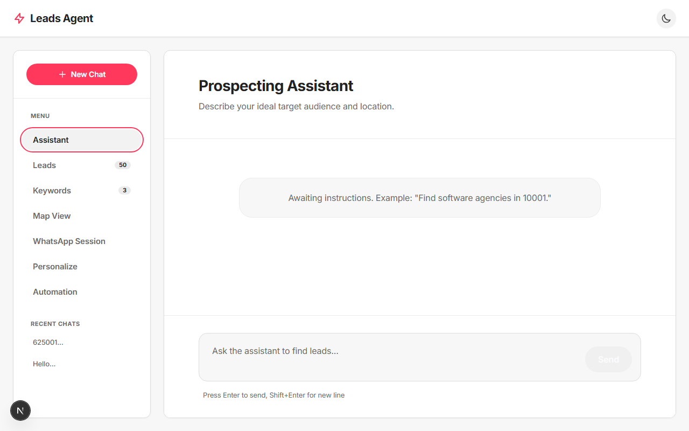
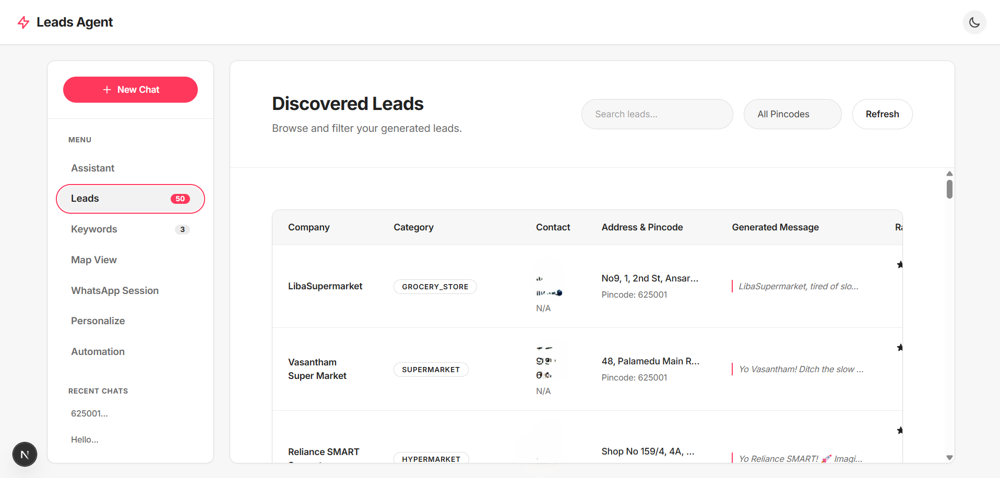
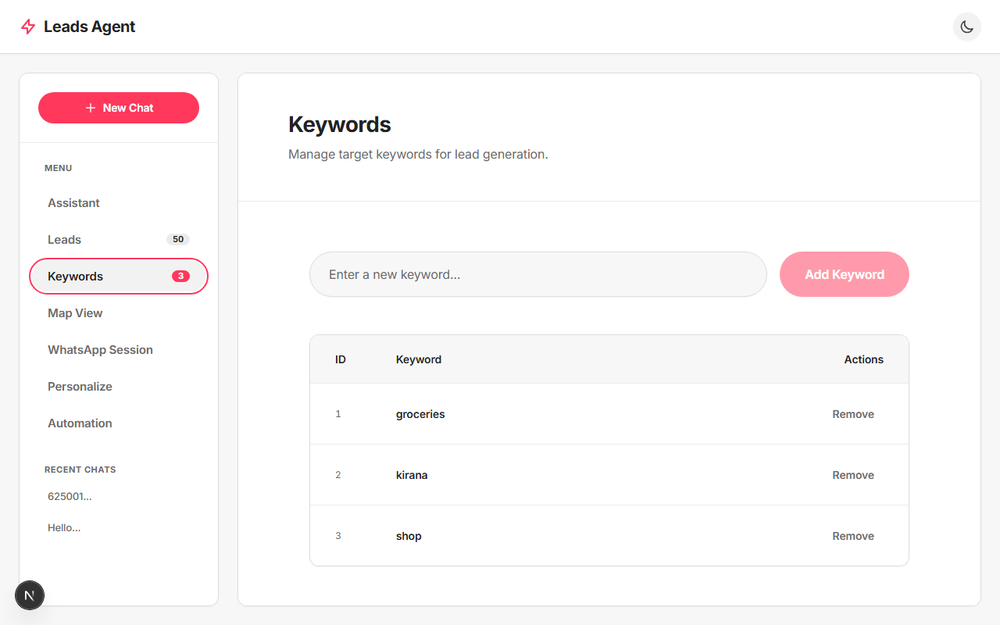
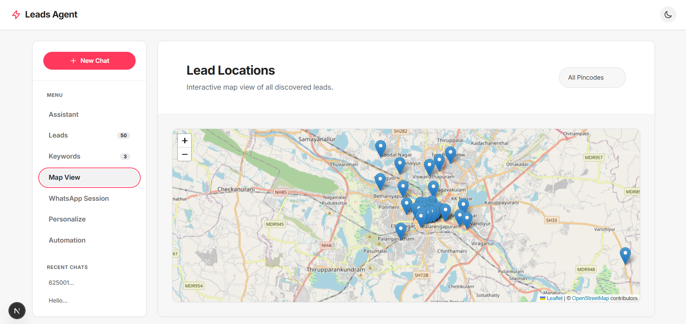
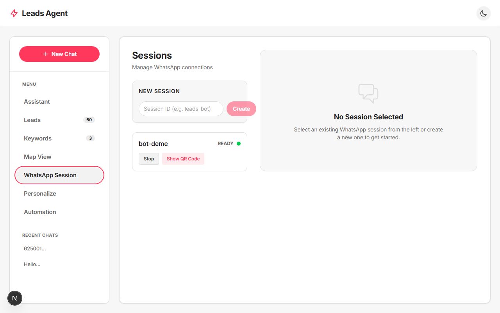
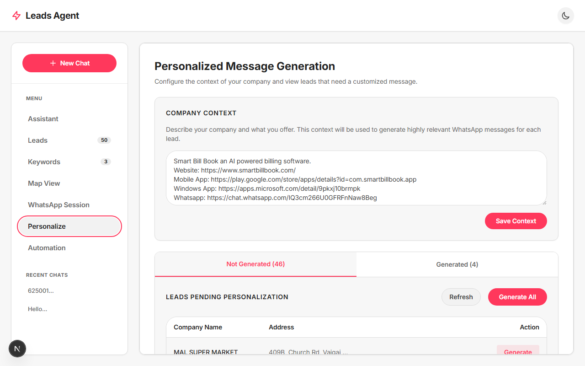
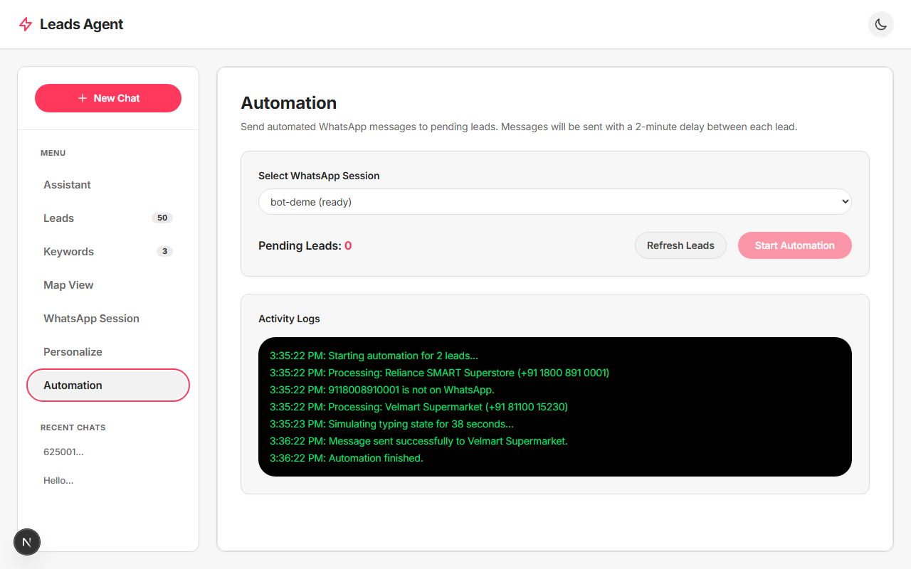

# 🚀 AI Leads Generator

An open-source, AI-powered lead generation dashboard built with **FastAPI**, **Google ADK (Gemini)**, and **Next.js**.

This platform allows you to conversationally ask an AI agent to find business leads (e.g., "Find software agencies in 10001"). The agent understands your query, triggers a backend search, saves the leads to a local SQLite database, and plots them beautifully on an interactive map.


---

## ✨ Features

| Feature | Description | Screenshot |
|---------|-------------|------------|
| 🤖 **Assistant (Chat)** | Built with Google ADK (Agent Development Kit). Just chat with the agent to request leads based on location or category. The agent extracts constraints and manages the scraping pipeline. |  |
| 👥 **Leads** | A clean table view to browse all your generated leads. Sort, filter, and track statuses seamlessly. Clicking on any lead brings up an exhaustive details view. |  |
| 🔑 **Keywords** | Manage specific keywords to target your search and refine what data gets extracted. |  |
| 📍 **Map View** | Visualize all your discovered leads on an interactive OpenStreetMap. See exactly where your prospects are located. |  |
| 📱 **WhatsApp Session** | Built-in support for OpenWA. Manage WhatsApp sessions by scanning a QR code, ensuring you are connected before sending out outreach messages. |  |
| ✨ **Personalize** | Configure your company's context to automatically generate highly tailored, human-sounding "GenZ vibe" WhatsApp messages for each individual lead using Gemini. Keep track of what's been generated and quickly regenerate text if you don't like the result. |  |
| ⚡ **Automation** | Send out the personalized WhatsApp messages in an automated, delayed sequence. The system first checks if the number is on WhatsApp, simulates a natural "typing" state for 20-45 seconds, sends the pitch, and then waits 2 minutes before contacting the next lead. Activity logs are preserved in the database. |  |

- **🎨 Modern UI/UX**: An elegant, Gen Z / Airbnb-inspired design system built entirely with **Tailwind CSS v4**. Features smooth animations, pill-shaped UI components, and high-contrast typography.
- **💾 Local Database**: Persists chat history, target keywords, and fetched leads into a local SQLite database (`leads.sqlite`).
- **⚡ Real-time Streaming**: Uses Server-Sent Events (SSE) to stream data from the backend to the frontend seamlessly.

## 🛠️ Tech Stack

**Frontend:**
- [Next.js](https://nextjs.org/) (App Router)
- React 19
- Tailwind CSS v4
- React-Leaflet (OpenStreetMap)

**Backend:**
- [FastAPI](https://fastapi.tiangolo.com/)
- Python 3.10+
- Google ADK (Agent Development Kit) & Gemini API
- SQLite

---

## 🚀 Getting Started

You can run this project using either **Docker Compose** (recommended for simplicity) or manually via the **Command Line**.

### 1. Clone the repository

```bash
git clone https://github.com/AgnelSelvan/leads-generator-agent.git
cd leads-generator-agent
```

### 2. Configure Environment Variables

1. Copy `.env.example` to a new file named `.env` in the root directory:
   ```bash
   cp .env.example .env
   ```
2. Open `.env` and add your API Keys:
   ```env
   GEMINI_API_KEY=your_gemini_api_key_here
   GOOGLE_MAPS_API_KEY=your_google_maps_api_key_here
   ```
   *(You can get a Gemini key from [Google AI Studio](https://aistudio.google.com/) and a Maps key from [Google Cloud Console](https://console.cloud.google.com/))*

3. Configure OpenWA variables for the frontend:
   ```bash
   cd web
   cp .env.example .env
   ```
   Open `web/.env` and update (if needed):
   ```env
   NEXT_PUBLIC_OPENWA_BASE_URL=http://localhost:2785
   NEXT_PUBLIC_OPENWA_API_KEY=your_openwa_api_key_here
   ```

### 3. Start the Project

#### Option A: Using Docker Compose (Recommended)
Return to the root directory and simply run:
```bash
docker-compose up --build
```
*Docker will automatically build the Next.js frontend, install Python dependencies, and start both the backend API (port 8000) and web application (port 3000).*

#### Option B: Manual Command Line
**Start the FastAPI Backend:**
```bash
# In the root directory
python -m venv venv
source venv/bin/activate  # Or `venv\Scripts\activate` on Windows
pip install -r requirements.txt
python api.py
```
*The API will start running at `http://localhost:8000`*

**Start the Next.js Frontend:**
```bash
# Open a new terminal window
cd web
npm install
npm run dev
```

### 4. Open the Dashboard
Open [http://localhost:3000](http://localhost:3000) in your browser to see the dashboard!

### 5. OpenWA Setup (WhatsApp)
To use the WhatsApp features, you must have an OpenWA server running on port `2785`.
Please refer to the [OpenWA documentation](https://openwa.dev/) for instructions on how to install and run the OpenWA API server alongside this project.

---

## 🤝 Contributing

Contributions, issues, and feature requests are welcome!
Feel free to check [issues page](https://github.com/AgnelSelvan/leads-generator-agent/issues).

1. Fork the Project
2. Create your Feature Branch (`git checkout -b feature/AmazingFeature`)
3. Commit your Changes (`git commit -m 'Add some AmazingFeature'`)
4. Push to the Branch (`git push origin feature/AmazingFeature`)
5. Open a Pull Request

## 📄 License

Distributed under the MIT License. See `LICENSE` for more information.

---

## ⚠️ Important Legal Disclaimer

**This project is provided for educational and research purposes only.**

**Scraping Google Maps violates Google's Terms of Service.**
The creators and contributors of this repository assume **no liability** for how you use this code.

If you plan to use this project in a production or commercial environment, you **must** replace the scraping script with a legitimate, ToS-compliant data source such as the [official Google Places API](https://developers.google.com/maps/documentation/places/web-service/overview), Yelp API, Apollo, or OpenStreetMap.
